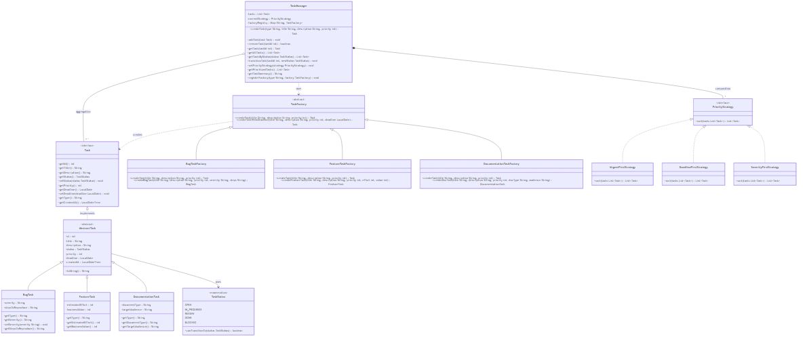

<!-- _class: title -->
<!-- _paginate: false -->

# Task Management<br>System

### A Java task tracker for software teams, built around two design patterns.

<span class="meta">SEN3006</span> <span class="meta">Software Architecture</span> <span class="meta">June 2026</span>

<div class="team">

**A. Malak** &nbsp;·&nbsp; <span class="role">domain, Strategy, SOLID, demo narration</span>
**M. Jendawy** &nbsp;·&nbsp; <span class="role">architecture, Factory Method, lifecycle, demo driver</span>

</div>

<!--
M and J (open together): Good morning, and thank you for having us. We are A. Malak and M. Jendawy, and over the next ten minutes we want to walk you through the Task Management System we built for SEN3006. It is a pure Java terminal application with no external libraries, which kept the focus on architecture rather than tooling. We picked a task tracker because two real frustrations our project team has had this semester map cleanly onto the two patterns we needed to demonstrate. We will spend most of our time on why we picked the patterns we picked, then run a live demo against the actual terminal app. If anything is unclear during the talk, please flag it and we will revisit at the end. Hand off to M for the agenda.
-->

---

<span class="pill">AGENDA</span>

## What we will cover

| # | Topic | Who |
|---|---|---|
| 1 | The task tracker problem in plain English | A. Malak |
| 2 | What we actually built | A. Malak |
| 3 | Architecture in one diagram | M. Jendawy |
| 4 | Factory Method, and why we used it | M. Jendawy |
| 5 | Strategy, and why we used it | A. Malak |
| 6 | Lifecycle as a state machine | M. Jendawy |
| 7 | Live demo | J drives, M narrates |
| 8 | Extending the system | A. Malak |
| 9 | SOLID, fast | A. Malak |
| 10 | Reflection and questions | Both |

<!--
J: Quick agenda. We are not going to spend slide time defining Factory Method or Strategy from scratch, since the lecture already covered the textbook side of both. What we want to do instead is justify our choices, which is the slides four and five block. The live demo at slide seven is where the patterns become visible, so if you have a question that is easier to answer with a click than a sentence, that is the moment to ask it. We are aiming for ten minutes of slides plus three minutes of demo. Hand off to M for the first content slide.
-->

---

<!-- _class: divider -->
<!-- _paginate: false -->

# 1. The problem

### Two things every team task tracker has to do

<!--
M: Before we talk about classes or patterns, we want to ground this in the actual problem. Every team task tracker, from a full Jira install to a row of sticky notes on a whiteboard, has to solve two specific things at minimum. The first is that tasks are not all the same shape, so creation logic gets messy fast. The second is that the same list of tasks needs to be sorted in different ways depending on the moment of the day. We picked Factory Method and Strategy because each one answers exactly one of these problems, and neither is the wrong tool for the other. The next two slides walk through these problems in detail before we show any code. Hand off stays with me for the first problem slide.
-->

---

<span class="pill">PROBLEM 1</span>

## Tasks are not all the same shape

A bug has a severity and steps to reproduce. A feature has an estimated effort in hours and a business value rating. A documentation task has a document type and a target audience. They share a `Task` interface, but the constructors are genuinely different.

```java
new BugTask(title, priority, "MEDIUM", "");
new FeatureTask(title, priority, 8, 5);
new DocumentationTask(title, priority, "API", "Developers");
```

Every place that creates tasks (the console menu and the scripted demo) would end up naming concrete classes. Adding a `ResearchTask` later means hunting all of those down.

> **Creational problem.** This is where Factory Method earns its keep.

<!--
M: Look at the three constructors on screen. The signatures are visibly different. Bug needs severity. Feature needs effort and value. Documentation needs an audience. Each type also has its own reasonable defaults, so even a shared static helper would collapse into a switch on the type string, which is exactly the smell we want to avoid. We hit this for real when we added Documentation late in development. Without a factory, we would have edited three call sites just to wire it in. Hand off to M again for problem two. Actually keep going, problem two is also mine, then we hand off to A.
-->

---

<span class="pill">PROBLEM 2</span>

## The same list needs different orderings

Sprint planning wants the list sorted by deadline. Incident response wants it by severity, with bugs first. The daily standup wants it by raw priority. Same list, three contexts, three orderings.

```java
switch (sortMode) {
    case DEADLINE: ... 50 lines ...
    case SEVERITY: ... 50 lines ...
    case URGENT:   ... 50 lines ...
}
```

Every new ordering rule edits the manager. That breaks Open/Closed the moment a fourth context appears.

> **Behavioral problem.** This is where Strategy earns its keep.

<!--
M: Three real contexts, not three contrived ones. Sprint planning, incident response, daily standup. The point is that the underlying list does not change, only the ordering does. If we hard-coded the sort logic inside the manager, every new context would mean opening and editing tested code. We wanted to be able to add a fourth or fifth sort without touching anything that already works. That requirement is exactly what Strategy gives you. A is going to walk through the Strategy choice in more depth later in the deck. Hand off to A here for the "what we built" section.
-->

---

<!-- _class: divider -->
<!-- _paginate: false -->

# 2. What we built

### One Java engine, two ways to drive it from the terminal

<!--
A: Now that the problem is on the table, let me show you what we actually shipped. The short version is one engine, two terminal drivers, sixteen Java files in total. No frameworks, no JUnit, no Maven, no Gradle. Just standard library Java compiled with javac. We made that call deliberately because the assignment is a software architecture course, not a build tooling course, and we wanted the architecture to be the only thing the reader has to evaluate. The next slide has the run instructions plus the numbers you would want to put on a code review checklist. Next slide.
-->

---

<span class="pill">OVERVIEW</span>

## The application

**Engine**
A single `TaskManager` holds the task list, the active sort strategy, and a registry of factories keyed by task type.

**How we run it (terminal application)**
1. `java -cp bin Main` runs five self-checking test sections from the command line. This is what the professor asked for.
2. `java -cp bin TaskManagementApp` opens an interactive console menu, also from the terminal.

**Numbers**
- 16 Java files
- 3 task types
- 3 sort strategies
- 5 lifecycle states

<!--
A: The TaskManager is the only stateful coordinator in the whole codebase. It holds the task list, the current strategy, and the factory registry. Around two hundred lines. Walk the audience through the two ways we run the app, both of them in the terminal. Main is the scripted self-check that runs five test sections end to end, and TaskManagementApp is the interactive menu where you can type a choice and see the engine respond. The professor asked for a terminal application, so that is what we built. The numbers on the bottom of the slide are the size of the codebase, sixteen files, three task types, three strategies, five lifecycle states. Hand off to J for the architecture diagram.
-->

---

<span class="pill">SECTION 3 · ARCHITECTURE</span>

## The class diagram



<!--
J: Three horizontal layers on this diagram. At the top, the TaskManager is the only coordinator. In the middle, you can see the factory hierarchy on the left and the strategy hierarchy on the right. At the bottom, the lifecycle enum sits on its own. Every arrow points towards an abstraction, which is the Dependency Inversion principle in shape form. The manager never imports a concrete BugTask, only the Task interface and the TaskFactory abstract class. The same is true for strategies. That is the structural reason adding a new task type does not touch the manager at all. Hand off to me for the Factory Method section, I am staying on.
-->

---

<!-- _class: divider -->
<!-- _paginate: false -->

# 4. Factory Method

### Why we picked it for `Task` creation

<!--
J: This is the first of our two pattern rationale slides. The point here is not to define Factory Method from scratch, the lecture has already covered the textbook version, and we trust the room to know it. The point is to explain why we picked it for this specific problem in this specific codebase, over the alternatives we considered. The alternatives we looked at were a single static helper, an interface with no shared behaviour, and the Abstract Factory pattern. We will explain why we landed on Factory Method specifically across the next two slides. The first one is the plain reason plus the call site, the second one defends the two design choices we expect questions on. Next slide.
-->

---

<span class="pill">PATTERN · FACTORY METHOD</span>

## We never name the task type directly

A bug, a feature, and a documentation task all carry different fields and different defaults. If the console code, the scripted demo, and the test code each wrote `new BugTask(...)` directly, adding a new task type later would mean hunting down every one of those spots and editing them. Instead, the manager keeps a small registry keyed by a string like `"BUG"`, and the call site just says "make me a `BUG`" without knowing which class that is.

Adding a Research task tomorrow is two new files plus one line of registration. Nothing the entry points already wrote has to change.

```java
manager.createTask("BUG", "Login broken", "OAuth callback fails", 8);
manager.createTask("FEATURE", "Dark mode", "Top user request", 5);
```

<!--
J: What we want the audience to hear is that the call site does not care which concrete class is built. The string "BUG" is a lookup key into a map of factories, and the manager picks the right one. We noticed during development that without this, every entry point would have to import every task class, and adding Documentation later would have meant editing the console menu and the scripted demo separately. With the registry, we wrote Documentation, registered it once, and the console menu picked it up automatically because it iterates the registry keys. If the professor asks "why a registry and not just an if-else," the answer is that the registry is what makes the call site type-agnostic. Hand off to me for the design choices.
-->

---

<span class="pill">PATTERN · FACTORY METHOD</span>

## Two design choices we want to flag

**Why is `TaskFactory` an abstract class and not just an interface?**
Because each task type has its own defaults. A bug defaults to medium severity. A feature defaults to 8 hours of effort and a business value of 5. A documentation task defaults to API docs aimed at developers. Putting those defaults in each subclass keeps them next to the type they describe, instead of scattering them into a static helper or pushing them onto every caller.

**Why is `createTaskWithDeadline(...)` already written on the base class?**
Because every task type needs a "create with a due date" variant, and we did not want to write it three times. The base class wraps the abstract `createTask(...)` call and attaches the deadline once. Subclasses only fill in the type-specific part. That is the Template Method shape sitting on top of Factory Method, and it is why a new variant later means editing one base class, not three.

<!--
J: The question we expect on this slide is the classic "interface or abstract class," and our answer is that the defaults belong with the type. A bug knowing it is medium severity by default is part of what makes it a bug factory, so we put it on the subclass instead of asking every caller to remember. The second question we expect is about the deadline wrapper. We want the audience to hear that we got Template Method almost for free, by putting the shared "attach a deadline" step on the base class. If we had used an interface, we would have had to copy that step into all three factories, or invent a helper class, both of which are uglier. Hand off to A for Strategy.
-->

---

<!-- _class: divider -->
<!-- _paginate: false -->

# 5. Strategy

### Why we picked it for sorting

<!--
A: This is the second of our two pattern rationale slides, and it follows the same structure as the Factory Method section. First we explain why we needed it, then we defend the two design choices we expect questions about. The Strategy pattern is the one that is most visible during the demo, because the user picks a sort from the console menu and the next listing comes back in the new order. So if you remember one pattern from this talk, please remember this one, because you will see it in action shortly. Next slide is the rationale plus the swap code.
-->

---

<span class="pill">PATTERN · STRATEGY</span>

## The same list, sorted three different ways

The same list of tasks needs different sorts in different moments. Sprint planning sorts by deadline. An incident sorts by severity, with bugs at the top. The daily standup sorts by raw priority. Without Strategy, the manager would carry one big switch statement covering all three, and we would have to edit it every time a new sort appeared. With Strategy, each sort is a swappable object, and changing the order is a single setter call. A fourth ordering tomorrow is one new file, zero edits to the manager.

```java
manager.setPriorityStrategy(new SeverityFirstStrategy());
// Next call to getPrioritizedTasks() uses the new sort.
```

<!--
A: What we want the audience to hear is that the manager does not know which sort is active. It just holds a `PriorityStrategy` field and calls `sort` on it. The interactive console has a menu option to change the sort, and the moment you pick a new one, the next listing comes out in the new order with no recompile. If the professor asks "is this not just Open/Closed dressed up," the honest answer is yes, this is what Open/Closed actually looks like in lines of code. New ordering, new file, manager untouched. We landed on this after we sketched the switch-statement version and saw how quickly it would grow. Hand off to me for the design choices.
-->

---

<span class="pill">PATTERN · STRATEGY</span>

## Two design choices we want to flag

**Why not just use Java's built-in `Comparator`?**
Because a name like `PriorityStrategy` tells the reader this is a swappable policy of the system, not a stray comparator buried in a utility class. And one of our strategies, `SeverityFirstStrategy`, does more than pairwise compare. It partitions bugs to the top of the list first, then orders the rest by priority. That partition-then-sort shape is awkward to express through a raw `Comparator`, which only knows how to look at two items at a time.

**Why is the strategy a setter, not a constructor argument?**
Because users change the sort while the app is running. If we passed the strategy into the manager at construction, picking a new sort would mean rebuilding the manager and copying every task into the new instance. One field plus one setter avoids all of that. The trade-off is that the manager is mutable on this one field, which we accepted because the alternative is worse.

<!--
A: The question we expect here is "could you not have just used Comparator." The honest answer is yes for two of the three strategies, no for the third. `SeverityFirstStrategy` partitions the list before sorting it, which is genuinely awkward as a `Comparator`. We also want the audience to hear that naming carries weight. `PriorityStrategy` reads as a role, `Comparator<Task>` reads as a utility. Readers of the codebase pick up on that difference. On the setter point, we considered constructor injection, but the interactive console swaps sorts mid-session, so a setter was the only design that did not force a rebuild. Hand off to J for the lifecycle section.
-->

---

<!-- _class: divider -->
<!-- _paginate: false -->

# 6. Lifecycle

### A third pattern, almost for free

<!--
J: Quick bonus section. We were not required to implement a State pattern for this assignment, the rubric only asks for one creational and one behavioral. But the lifecycle of a task naturally maps onto a state machine, and we wanted the engine to refuse illegal transitions at runtime rather than at code review time. So we got a third pattern almost for free, sitting inside a single enum file. No extra classes, no scattered conditionals, no Spring State Machine library. The next slide shows the actual transition diagram and the enforcement mechanism. We will keep this brief because it is a bonus, not a main course. Next slide.
-->

---

<span class="pill">BONUS · STATE</span>

## `TaskStatus` is its own state machine

```
OPEN ──► IN_PROGRESS ──► REVIEW ──► DONE      (terminal)
           ▲ ▼               │
         BLOCKED              └► IN_PROGRESS  (rejected, back to dev)

BLOCKED ──► OPEN              (unblock)
```

Each enum constant declares its allowed next states through `canTransitionTo(...)`. `AbstractTask.setStatus(...)` checks that method and throws `IllegalArgumentException` on illegal moves.

> The State pattern, expressed in a single enum file. No extra classes, no scattered conditionals.

<!--
J: Let me walk through a normal path. A task starts at OPEN. A developer picks it up, so it moves to IN_PROGRESS. They finish and request review, so it moves to REVIEW. The reviewer approves, so it goes to DONE, which is terminal. The reviewer can also reject, which sends it back to IN_PROGRESS. At any active stage the task can be BLOCKED, and once unblocked it returns to OPEN to be picked up again. The enforcement lives on the enum itself through canTransitionTo. So the engine refuses to let you skip from OPEN to DONE, you have to walk the cycle. We caught two real bugs with this during development. Hand off to A for the demo.
-->

---

<!-- _class: divider -->
<!-- _paginate: false -->

# 7. Live demo

### About three minutes

<!--
A: This is the demo section, which we have rehearsed to fit inside three minutes. J is going to drive the laptop, I am going to narrate what is happening on screen, and we will explicitly pause after each step so questions can land in the moment. Five short steps total, no live coding. If anything on the screen is hard to see from the back of the room, please flag it and we will zoom in with the screen reader hotkey before we move on. We have run this demo end to end six times this week, so the timing is realistic, but we have backup transcripts saved if anything misbehaves. Next slide lists the five steps in order.
-->

---

<span class="pill">DEMO · J drives, M narrates</span>

## What we will show in the demo

1. **Scripted self-checks.** `java -cp bin Main`. Five test sections run, each ending in `[PASS]`. Pause on Test 1 (Factory Method) and Test 2 (Strategy) to call out what is happening.
2. **Interactive console.** `java -cp bin TaskManagementApp`. Open the menu, create a `BUG` task, create a `FEATURE` task, switch the sort strategy from Urgent First to Severity First, print the list.
3. **Swap the strategy live.** Inside the interactive console, type the menu option to change the sort and pick `DeadlineFirstStrategy`. Print the list again. The order changes in front of you, the manager itself was never recompiled.
4. **Trigger a factory error.** Type the option to create a task with type `"FOO"`. The engine throws, the console prints the exact reason.
5. **Trigger an illegal transition.** Pick an `OPEN` task and try to mark it `DONE` directly. The engine refuses with the transition that was attempted.

<!--
A: A couple of things to flag while J runs the demo. First, validation lives in the engine, not in any one driver. The console prints what the engine threw, exactly as you would expect. Second, steps four and five are intentional. They show that the engine rejects bad input, which is why we trust the lifecycle and the factory registry. We are also intentionally skipping the integration test section to keep the demo under three minutes. J, take it away when ready. After the demo we move straight on to how the system extends. Hand off to J at the laptop, then back to A for the extension divider.
-->

---

<!-- _class: divider -->
<!-- _paginate: false -->

# 8. Extending it

### What changes if you add a new task type or sort rule

<!--
A: This is the slide where we make Open/Closed concrete rather than abstract. Two short "what if" scenarios. The first is adding a new task type, specifically a Research task. The second is adding a new sort rule, specifically a cheapest first strategy. In both cases we are going to count the edits to existing files, and in both cases that count is zero. The reason this matters is that the day a real project adds its tenth task type, you do not want a tenth pull request that touches the same central manager class, because that file becomes a merge conflict magnet. The next slide shows the actual code edits side by side.
-->

---

<span class="pill">EXTENSION</span>

## Two "what if" cases

<div class="grid2">

<div>

**Add a `ResearchTask`**
```java
class ResearchTask extends AbstractTask { ... }

class ResearchTaskFactory
    extends TaskFactory { ... }

manager.registerFactory(
    "RESEARCH", new ResearchTaskFactory());
```
*Zero edits to TaskManager, strategies, or other factories. The console menu picks it up automatically because it iterates the registry.*

</div>

<div>

**Add a `CheapestFirstStrategy`**
```java
class CheapestFirstStrategy
    implements PriorityStrategy { ... }

manager.setPriorityStrategy(
    new CheapestFirstStrategy());
```
*Zero edits to TaskManager or existing strategies. Add it to the console menu to expose it to the user.*

**Why this matters**
- Open/Closed in literal numbers.
- New features without touching tested code.
- Test 5 in `Main.java` proves the same property at runtime.

</div>

</div>

<!--
A: Walk through the left block first. Adding a Research task is two new files, a class and a factory, plus one line of registration. Zero edits to existing code. Now the right block. A new sort is one new file plus one setter call. Same story, zero edits to existing code. The phrase we want you to take away is "zero edits to existing files." That is what Open/Closed actually means in practice, and we wrote Test 5 in Main.java specifically to assert this property at runtime, so we can prove it in the demo too. Next slide is the SOLID summary.
-->

---

<span class="pill">SOLID · fast</span>

## How the design lines up with SOLID

- **S, Single Responsibility.** Factories build, strategies sort, the manager coordinates. One job each.
- **O, Open/Closed.** New task type, new sort rule. Neither edits existing classes.
- **L, Liskov.** Every factory subclass and every strategy implementation can stand in for its abstraction without surprises.
- **I, Interface Segregation.** `PriorityStrategy` has one method. The `Task` interface is minimal.
- **D, Dependency Inversion.** `TaskManager` references only abstractions. There is no `new BugTask(...)` inside the manager.

<!--
A: Ten seconds per principle, do not dwell. The S, O, and D points are the strongest. L and I are honest but smaller. If we are short on time, the principle we drop is Liskov, because it is more philosophical than testable on a project this size. If the professor asks for a single example of D, point at the line "TaskManager references only abstractions" and then point at the class diagram on slide eight. Hand off to J for the wrap-up section.
-->

---

<!-- _class: divider -->
<!-- _paginate: false -->

# 9. Wrapping up

### What worked, what we would do next

<!--
J: We are at the end of the slide deck itself. One honest reflection slide left, then we open the floor for questions. We wrote the reflection slide without using marketing language on purpose. This is a teaching project, not a piece of production software, so it would be silly to pretend the "what worked" column is the whole story. The "what next" column matters just as much, because it shows we understand the gaps between this codebase and something you could actually run on a team. We will spend about thirty seconds per column, then go straight to the Q and A slide. Next slide is the reflection.
-->

---

<span class="pill">REFLECTION</span>

## Honest reflection

<div class="grid2">

<div>

**What worked**

- The factory registry meant every entry point auto-discovered new task types. We confirmed this when we added Documentation late in the project.
- The Strategy interface let us prototype four orderings in one afternoon and then keep the best three.
- The lifecycle enum caught two real bugs during development that would have shipped otherwise.
- The scripted `Main` doubled as a test harness without us pulling in JUnit.

</div>

<div>

**What we would do next**

- Persistence. Everything currently lives in memory.
- Tag based filtering with a Specification pattern. The console already filters by status, tags would be the next step.
- Async dispatch for long running operations.
- A small REST layer on top of the same engine.

</div>

</div>

<!--
J: The "what worked" column is not us patting ourselves on the back, it is evidence that the patterns paid off in measurable ways. The Documentation addition late in the project is the strongest piece of evidence, because it took us under thirty minutes from "we need this" to "the console menu offers it." The "what next" column is a roadmap, not an apology. Persistence is the most obvious gap. A REST layer would be the most interesting extension because it would prove the engine really is decoupled from any one frontend. Hand off to both for the Q and A slide.
-->

---

<!-- _class: title -->
<!-- _paginate: false -->

# Questions?

### Thank you for listening.

<div class="team">

**A. Malak** &nbsp;&nbsp;&nbsp; **M. Jendawy**

</div>

<!--
M and J: Thank you for your time, and we are happy to take questions. We will split them by area. J will field anything about Factory Method, the lifecycle, or the overall architecture. A will field anything about Strategy, the domain framing, SOLID, or extension. If a question lands in the middle, we will defer to whoever wrote the relevant code, which we can clarify on a per-question basis. If we cannot answer a question fully right now, we will follow up by email rather than guess. Hand off to the audience.
-->
