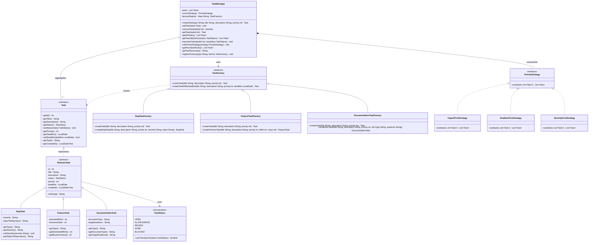
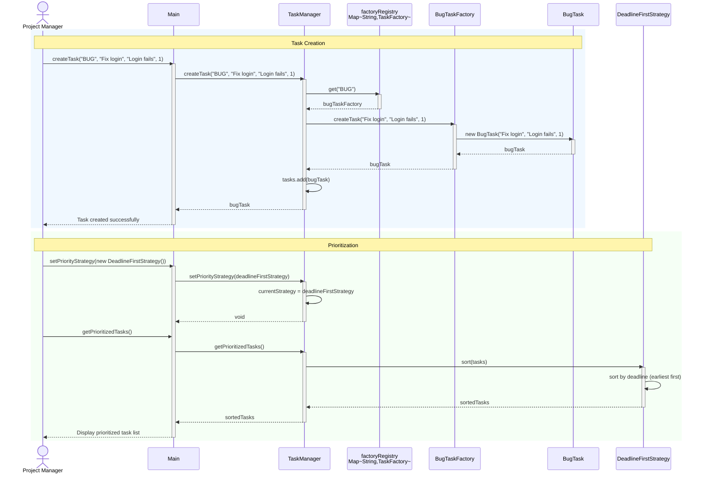
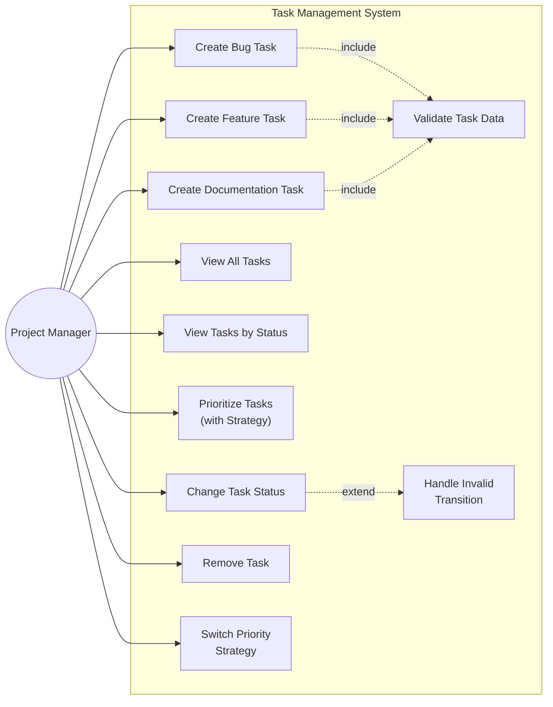
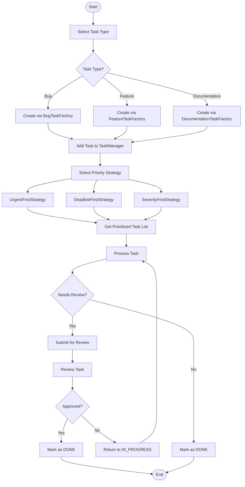
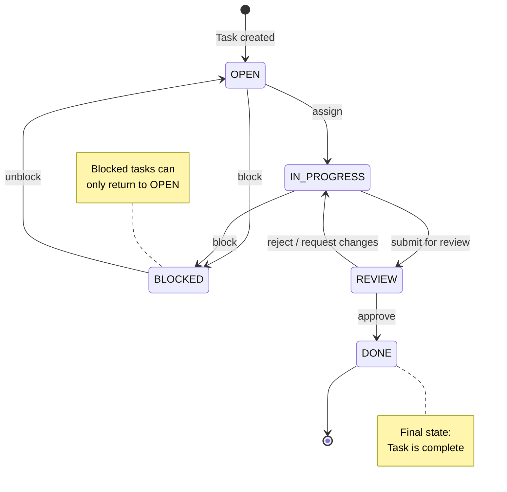
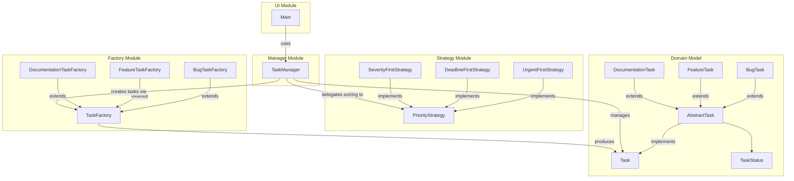
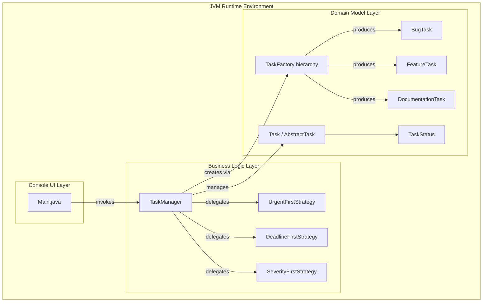

# SEN3006 - Software Architecture

# Java Design Pattern Project

---

**Project Title:** Task Management System for Software Development Teams

**Design Patterns:** Factory Method (Creational) + Strategy (Behavioral)

**Course:** SEN3006 - Software Architecture

**Date:** March 2026

---

## Table of Contents

1. [Introduction](#1-introduction)
2. [Problem Definition and System Requirements](#2-problem-definition-and-system-requirements)
3. [Design Pattern Explanation](#3-design-pattern-explanation)
4. [System Design and UML Diagrams](#4-system-design-and-uml-diagrams)
5. [Implementation (Code Explanation)](#5-implementation-code-explanation)
6. [Testing and Demonstration](#6-testing-and-demonstration)
7. [Results and Evaluation](#7-results-and-evaluation)
8. [Conclusion](#8-conclusion)
9. [References](#9-references)

---

## 1. Introduction

### 1.1 Background

Software development teams operate in environments where multiple types of work items coexist and compete for attention. A typical sprint backlog contains bug reports that describe software defects requiring immediate resolution, feature requests that capture new functionality desired by stakeholders, and documentation tasks that ensure the system remains understandable and maintainable. Each of these task types carries its own set of attributes: bugs have severity levels and reproduction steps, features have effort estimates and business value scores, and documentation tasks have document types and target audiences. Managing this heterogeneous collection of work items through a single, rigid system quickly becomes unsustainable as the team and product grow.

The challenge is compounded by the fact that different situations call for different prioritization approaches. During a production incident, the team needs to see critical bugs at the top of their queue. During sprint planning, tasks approaching their deadlines take precedence. During a stabilization phase before a major release, all bugs---regardless of their general priority level---must be addressed before any new feature work begins. A well-designed task management system must accommodate all of these scenarios without requiring code changes each time the team's focus shifts.

### 1.2 Motivation

Traditional approaches to building task management systems often result in monolithic designs where task creation logic is embedded in conditional statements (if-else or switch blocks) and prioritization algorithms are hard-coded into the sorting methods. When a new task type is introduced---say, a `ResearchTask` or a `TestTask`---developers must locate and modify every conditional block that handles task types. Similarly, introducing a new prioritization rule requires modifying the existing sorting code, risking regressions in the established behavior. This tight coupling between the system's structure and its specific task types and algorithms violates fundamental software engineering principles and creates a maintenance burden that grows with every addition.

Design patterns offer a proven solution to these architectural challenges. By applying well-established object-oriented design patterns, we can create a system that is inherently extensible, where new task types and new prioritization algorithms can be added purely through addition of new classes, without modifying any existing code. This approach aligns with the SOLID principles that form the foundation of maintainable software architecture.

### 1.3 Objectives

The primary objectives of this project are:

1. **Demonstrate the Factory Method pattern** as a solution for flexible, polymorphic object creation in a real-world context.
2. **Demonstrate the Strategy pattern** as a solution for interchangeable algorithms that can be swapped at runtime.
3. **Apply SOLID principles** throughout the design to achieve a system that is maintainable, extensible, and testable.
4. **Build a complete, working system** in pure Java with zero external dependencies, proving that good architecture does not require complex frameworks.

### 1.4 Solution Overview

The Task Management System implements two complementary design patterns. The **Factory Method** pattern (Creational) handles task creation: an abstract `TaskFactory` declares the creation interface, and concrete factories (`BugTaskFactory`, `FeatureTaskFactory`, `DocumentationTaskFactory`) encapsulate the instantiation logic for each task type. The **Strategy** pattern (Behavioral) handles task prioritization: a `PriorityStrategy` interface defines a sorting contract, and concrete strategies (`UrgentFirstStrategy`, `DeadlineFirstStrategy`, `SeverityFirstStrategy`) provide interchangeable sorting algorithms. A central `TaskManager` class coordinates both patterns, acting as the client of the Factory Method pattern and the context of the Strategy pattern. The system comprises 16 classes in total, including 2 interfaces, 1 enum, 1 abstract class, and 12 concrete classes, all built using only the Java standard library.

---

## 2. Problem Definition and System Requirements

### 2.1 Problem Statement

Software development teams must manage a diverse collection of work items that differ not only in their data but in their workflows and prioritization needs. A bug report requires severity classification and reproduction steps to enable efficient debugging. A feature request needs effort estimates and business value scores to support ROI-based backlog prioritization. A documentation task specifies document types and target audiences to guide technical writers. Despite these differences, all tasks share common properties---an identifier, a title, a status, a priority, and a deadline---and all must move through a defined lifecycle from creation to completion.

The core architectural problem is twofold. First, the system must create different types of tasks without coupling the creation logic to the specific task classes, so that adding a new task type does not require modifying existing code. Second, the system must support multiple prioritization algorithms that can be selected and swapped at runtime, allowing the team to adapt their workflow to changing circumstances without redeployment or code changes.

### 2.2 Functional Requirements

| ID   | Requirement                                                                                         |
|------|-----------------------------------------------------------------------------------------------------|
| FR-1 | The system shall create tasks of different types (Bug, Feature, Documentation) through a uniform interface. |
| FR-2 | Each task type shall carry type-specific attributes (e.g., severity for bugs, effort for features).  |
| FR-3 | The system shall support multiple prioritization strategies that can be swapped at runtime.           |
| FR-4 | Tasks shall follow a defined lifecycle with valid state transitions enforced by a state machine.      |
| FR-5 | The system shall support filtering tasks by status (OPEN, IN_PROGRESS, REVIEW, DONE, BLOCKED).       |
| FR-6 | The system shall allow registration of new task factories at runtime without modifying existing code. |
| FR-7 | The system shall provide a task summary report grouped by status.                                     |

### 2.3 Non-Functional Requirements

| ID    | Requirement                                                                                         |
|-------|-----------------------------------------------------------------------------------------------------|
| NFR-1 | **Extensibility:** New task types shall be addable by creating a new concrete task class and a corresponding factory, without modifying any existing class. |
| NFR-2 | **Extensibility:** New prioritization strategies shall be addable by implementing the PriorityStrategy interface, without modifying the TaskManager or existing strategies. |
| NFR-3 | **Maintainability:** The system shall follow SOLID principles (SRP, OCP, LSP, ISP, DIP) throughout its design. |
| NFR-4 | **Testability:** Each component (factories, strategies, state machine) shall be independently testable. |
| NFR-5 | **Zero Dependencies:** The system shall use only Java standard library classes, requiring no external frameworks or libraries. |

### 2.4 Why Architecture Matters

Without design patterns, adding a new task type such as `ResearchTask` would require modifying the `TaskManager` to add a new case to its creation logic, potentially modifying filtering and display methods, and updating every location that uses type-specific conditionals. This violates the Open/Closed Principle (OCP) and creates a fragile design where a single change can cascade through the entire codebase. Similarly, without the Strategy pattern, adding a new prioritization algorithm would require modifying the sorting code in the `TaskManager`, risking regressions in existing sorting behavior and violating the Single Responsibility Principle (SRP). The architectural decisions made in this project eliminate these problems by design, ensuring that the system grows through addition rather than modification.

---

## 3. Design Pattern Explanation

### 3.1 Factory Method Pattern (Creational)

#### 3.1.1 Definition

The Factory Method pattern defines an interface for creating objects but lets subclasses decide which class to instantiate. It defers instantiation to subclasses, allowing a class to delegate the responsibility of object creation to its subclasses rather than creating objects directly. The pattern introduces a parallel hierarchy: a Creator hierarchy (factories) mirrors the Product hierarchy (the objects being created), and each concrete creator knows how to instantiate one specific concrete product.

#### 3.1.2 When and Why It Is Used

The Factory Method pattern is used when:

- A class cannot anticipate the exact type of objects it needs to create.
- A class wants its subclasses to specify the objects it creates.
- The creation logic involves complexity (default values, validation, configuration) that should be encapsulated rather than scattered across client code.
- The system needs to be extensible so that new product types can be introduced without modifying existing code.

The pattern is particularly valuable when there is a family of related classes that share a common interface but differ in their construction parameters and internal state. By encapsulating the `new` keyword inside factory methods, the pattern eliminates direct coupling between client code and concrete classes.

#### 3.1.3 Advantages

1. **Eliminates direct coupling** between the client code and concrete product classes. The client works only with the abstract `Task` interface, never needing to know about `BugTask`, `FeatureTask`, or `DocumentationTask`.
2. **Supports the Open/Closed Principle:** New task types can be added by creating a new concrete product and a new concrete factory. No existing class needs modification.
3. **Centralizes creation logic:** Default values, validation rules, and initialization steps are encapsulated within each factory, preventing duplication and inconsistency.
4. **Enables polymorphic creation:** The same client code can create different types of tasks simply by receiving a different factory instance, enabling flexible configuration and testing.

#### 3.1.4 Why Suitable for This Project

In this Task Management System, each task type has distinct construction requirements. A `BugTask` requires severity and reproduction steps, a `FeatureTask` requires effort estimates and business values, and a `DocumentationTask` requires document types and target audiences. Without the Factory Method pattern, the `TaskManager` would need a series of conditional statements to handle each type, and every new task type would require modifying these conditionals. With the pattern, the `TaskManager` delegates creation to a registry of factory instances, each of which knows how to construct its specific task type with appropriate defaults and validation. Adding a new task type---say `ResearchTask`---requires only creating `ResearchTask` (extending `AbstractTask`) and `ResearchTaskFactory` (extending `TaskFactory`), then registering the factory with the `TaskManager`. Zero existing classes change.

#### 3.1.5 Real-World Example: JDBC

Java's **JDBC (Java Database Connectivity)** framework is a classic example of the Factory Method pattern. The `DriverManager.getConnection()` method acts as a factory that creates database `Connection` objects. The caller specifies a connection URL, and the `DriverManager` selects the appropriate JDBC driver (MySQL, PostgreSQL, Oracle) to create the connection. The client code works entirely through the `Connection` interface and never references the driver-specific implementation class. When a new database vendor releases a JDBC driver, the system supports it without any changes to client code---the new driver simply registers itself with the `DriverManager`, exactly as new factories register with the `TaskManager` in our system.

---

### 3.2 Strategy Pattern (Behavioral)

#### 3.2.1 Definition

The Strategy pattern defines a family of algorithms, encapsulates each one in a separate class, and makes them interchangeable. The pattern lets the algorithm vary independently from the clients that use it. A context class holds a reference to a strategy interface, and concrete strategy classes implement different algorithms behind that interface. The context delegates algorithmic work to whichever strategy is currently set, and the strategy can be swapped at runtime without modifying the context.

#### 3.2.2 When and Why It Is Used

The Strategy pattern is used when:

- Multiple algorithms exist for a specific task, and the appropriate algorithm should be selected at runtime.
- A class defines many behaviors through conditional statements (if-else or switch), and each branch represents a different algorithm.
- Related classes differ only in their behavior, not in their structure.
- An algorithm uses data that clients should not know about, and the pattern can encapsulate this data within the strategy.

The pattern is especially valuable in systems where the same data needs to be processed differently depending on the current context or user preference. Rather than embedding all possible algorithms in a single class and selecting among them with conditionals, the Strategy pattern isolates each algorithm in its own class, making it easier to understand, test, and extend.

#### 3.2.3 Advantages

1. **Runtime algorithm swapping:** The prioritization strategy can be changed at runtime by calling `setPriorityStrategy()` on the `TaskManager`, allowing the team to adapt their workflow instantly.
2. **Eliminates conditional logic:** Without the pattern, the `TaskManager` would contain multiple if-else blocks for each sorting approach. The pattern replaces these conditionals with polymorphism.
3. **Supports the Open/Closed Principle:** New strategies can be added by implementing the `PriorityStrategy` interface. The `TaskManager` and all existing strategies remain unchanged.
4. **Improves testability:** Each strategy can be unit-tested in isolation with a known list of tasks and expected output ordering.
5. **Encapsulates algorithm-specific knowledge:** The `SeverityFirstStrategy` contains the severity ranking logic (CRITICAL > HIGH > MEDIUM > LOW), keeping this domain knowledge contained rather than scattered.

#### 3.2.4 Why Suitable for This Project

Task prioritization is inherently context-dependent. A team in crisis mode needs urgent-first ordering. A team planning a sprint needs deadline-first ordering. A team stabilizing for release needs severity-first ordering. These are fundamentally different algorithms operating on the same data. The Strategy pattern allows the `TaskManager` to support all of these approaches---and any future approach---through a single `sort()` method call delegated to the current strategy. The `TaskManager` does not need to know the details of any sorting algorithm; it simply trusts that the strategy will return a correctly sorted list. This separation of concerns keeps the `TaskManager` focused on coordination while strategies focus on sorting logic.

#### 3.2.5 Real-World Example: Comparator

Java's `java.util.Comparator` interface is a Strategy pattern in the standard library. The `Collections.sort()` method accepts a `Comparator` that defines the comparison strategy. The same list can be sorted by name, by date, by size, or by any custom criterion simply by passing a different `Comparator` instance. Another real-world example is **payment processing systems**, where a payment service holds a reference to a payment strategy interface, and concrete strategies handle credit card payments, PayPal payments, bank transfers, and cryptocurrency payments. The payment service delegates transaction processing to whichever strategy the user selects at checkout, without needing conditional logic for each payment method.

---

## 4. System Design and UML Diagrams

This section presents the system design through seven UML diagrams, each illustrating a different aspect of the architecture.

### 4.1 Class Diagram

The class diagram is the central architectural artifact of this project. It shows the complete structure of all classes and their relationships. The diagram is organized into distinct regions:

- **Product hierarchy:** The `Task` interface at the top, with `AbstractTask` providing the skeletal implementation, and three concrete products (`BugTask`, `FeatureTask`, `DocumentationTask`) extending it. Each concrete product adds its type-specific fields.
- **Creator hierarchy:** The abstract `TaskFactory` declares the `createTask()` factory method and provides a `createTaskWithDeadline()` template method. Three concrete factories override the factory method to instantiate their respective products with sensible defaults.
- **Strategy hierarchy:** The `PriorityStrategy` interface declares a single `sort()` method. Three concrete strategies implement different sorting algorithms.
- **Coordinator:** The `TaskManager` aggregates a `List<Task>`, holds a `PriorityStrategy` reference, and maintains a `Map<String, TaskFactory>` factory registry.

Key relationships include: implementation (Task interface), inheritance (AbstractTask to concrete tasks, TaskFactory to concrete factories), composition (TaskManager owns the task list), aggregation (TaskManager uses strategies), and dependency (factories create specific task types).



### 4.2 Sequence Diagram

The sequence diagram illustrates the runtime interaction flow when a task is created through the `TaskManager` and subsequently prioritized. The flow shows how the client request passes through the `TaskManager`, which looks up the appropriate factory in its registry, delegates creation to the factory, and stores the resulting task. The prioritization flow demonstrates the Strategy pattern: the `TaskManager` delegates sorting to the currently active `DeadlineFirstStrategy`, which returns a newly sorted list without modifying the original collection.

This diagram clearly shows how the client never directly interacts with `BugTask` or `BugTaskFactory`---it works entirely through the `TaskManager` and `Task` abstractions, demonstrating the Dependency Inversion Principle.



### 4.3 Use Case Diagram

The use case diagram identifies the primary actor (Project Manager) and the system's functional capabilities. Task creation use cases include validation as an included sub-flow, and changing task status may trigger invalid-transition handling as an extension. The diagram shows that the system's primary value proposition is enabling teams to manage heterogeneous tasks with flexible prioritization.



### 4.4 Activity Diagram

The activity diagram models the complete workflow of task management from task creation through completion. It shows the decision points where the user chooses a task type, the factory selection that follows, the lifecycle management with state transitions, and the prioritization step where a strategy is applied. The diagram includes a review/rework loop, reflecting real-world development workflows where tasks may be sent back for changes after code review.



### 4.5 State Diagram

The state diagram models the `TaskStatus` enum's finite state machine. It shows five states (OPEN, IN_PROGRESS, REVIEW, DONE, BLOCKED) with their allowed transitions. This state machine is enforced programmatically by the `canTransitionTo()` method in the `TaskStatus` enum. Each enum constant overrides the `allowedTransitions()` method to declare its valid targets, and `AbstractTask.setStatus()` validates every transition against these rules, throwing an `IllegalArgumentException` for invalid transitions.



### 4.6 Component Diagram

The component diagram shows the system's high-level module structure organized into five logical components. The UI Module contains the `Main` class. The Manager Module contains the `TaskManager`. The Factory Module houses the `TaskFactory` hierarchy. The Strategy Module houses the `PriorityStrategy` hierarchy. The Domain Model contains the core abstractions (`Task`, `AbstractTask`, `TaskStatus`) and concrete task types. Dependency arrows flow from the Manager toward abstractions in the other modules, demonstrating the Dependency Inversion Principle at the component level.



### 4.7 Deployment Diagram

The deployment diagram shows the system's layered runtime architecture within a JVM environment. The Console UI Layer handles user interaction through `Main.java`. The Business Logic Layer contains the `TaskManager` and the three prioritization strategies. The Domain Model Layer holds the task entities, factories, and the `TaskStatus` enum. This layered structure ensures separation of concerns and aligns with standard enterprise architecture practices.



---

## 5. Implementation (Code Explanation)

### 5.1 Core Abstractions

The system's foundation rests on two key abstractions: the `Task` interface and the `AbstractTask` class.

The **`Task` interface** defines the contract that all task types must satisfy. It declares methods for accessing common properties: `getId()`, `getTitle()`, `getDescription()`, `getStatus()`, `setStatus()`, `getPriority()`, `getDeadline()`, `setDeadline()`, `getType()`, and `getCreatedAt()`. By declaring this as an interface rather than a concrete class, the system ensures that high-level modules depend on this abstraction rather than on specific implementations, satisfying the Dependency Inversion Principle. The interface is deliberately lean: type-specific methods like `getSeverity()` or `getEstimatedEffort()` are not included, adhering to the Interface Segregation Principle.

```java
public interface Task {
    int getId();
    String getTitle();
    String getDescription();
    TaskStatus getStatus();
    void setStatus(TaskStatus status);
    int getPriority();
    LocalDate getDeadline();
    void setDeadline(LocalDate deadline);
    String getType();
    LocalDateTime getCreatedAt();
}
```

The **`AbstractTask`** class provides a skeletal implementation of the `Task` interface, eliminating boilerplate in concrete task classes. It manages the shared fields (id, title, description, status, priority, deadline, createdAt), includes a static `idCounter` for auto-incrementing IDs, and implements the state transition validation in `setStatus()`:

```java
@Override
public void setStatus(TaskStatus status) {
    if (!this.status.canTransitionTo(status)) {
        throw new IllegalArgumentException(
                "Cannot transition from " + this.status + " to " + status);
    }
    this.status = status;
}
```

### 5.2 Concrete Task Types

Three concrete products extend `AbstractTask`:

- **`BugTask`** adds `severity` (String: LOW, MEDIUM, HIGH, CRITICAL) and `stepsToReproduce` (String). The severity is mutable via `setSeverity()` to support re-classification after triage.
- **`FeatureTask`** adds `estimatedEffort` (int, in hours) and `businessValue` (int, 1-10 scale). Both are immutable after construction, reflecting the fact that these values are typically set during planning and not changed mid-sprint.
- **`DocumentationTask`** adds `documentType` (String: API, USER_GUIDE, TUTORIAL) and `targetAudience` (String). Both are immutable.

Each concrete task overrides `getType()` to return its type identifier ("BUG", "FEATURE", or "DOCUMENTATION") and extends `toString()` to include its specific fields.

### 5.3 Factory Method Implementation

The **`TaskFactory`** abstract class declares the factory method and provides a template method:

```java
public abstract class TaskFactory {

    public abstract Task createTask(String title, String description, int priority);

    public Task createTaskWithDeadline(String title, String description,
                                        int priority, LocalDate deadline) {
        Task task = createTask(title, description, priority);
        task.setDeadline(deadline);
        return task;
    }
}
```

The `createTaskWithDeadline()` template method demonstrates how the Creator can contain logic that depends on the product created by the factory method, without knowing which concrete product it will receive.

Each concrete factory overrides `createTask()` to instantiate its specific product with sensible defaults:

- **`BugTaskFactory`** creates `BugTask` with default severity "MEDIUM" and empty steps-to-reproduce. It also provides a `createBugTask()` method for full-parameter construction.
- **`FeatureTaskFactory`** creates `FeatureTask` with default effort of 8 hours and business value of 5. It provides `createFeatureTask()` for full control.
- **`DocumentationTaskFactory`** creates `DocumentationTask` with default type "API" and audience "Developers". It provides `createDocTask()` for full control.

### 5.4 Strategy Implementation

The **`PriorityStrategy`** interface declares a single method:

```java
public interface PriorityStrategy {
    List<Task> sort(List<Task> tasks);
}
```

Implementations must return a new sorted list without modifying the input, preserving immutability of the caller's data. Three concrete strategies provide different sorting algorithms:

- **`UrgentFirstStrategy`:** Sorts by priority descending (5 to 1) using `Integer.compare(b.getPriority(), a.getPriority())`. Designed for crisis scenarios where the most critical tasks must be addressed first.
- **`DeadlineFirstStrategy`:** Sorts by deadline ascending (earliest first), using `Comparator.nullsLast()` to push tasks without deadlines to the end. Designed for sprint planning and deadline-driven workflows.
- **`SeverityFirstStrategy`:** Implements a two-tier sort. All `BugTask` instances are placed first, sorted by severity rank (CRITICAL=4, HIGH=3, MEDIUM=2, LOW=1). Non-bug tasks follow, sorted by priority descending. This strategy uses `instanceof` to detect bug tasks and a `getSeverityRank()` helper to convert severity strings to numeric ranks.

### 5.5 TaskManager Coordination

The **`TaskManager`** is the central coordinator that bridges both patterns:

**Factory Method Client:** Maintains a `Map<String, TaskFactory>` registry, pre-populated with BUG, FEATURE, and DOCUMENTATION factories. The `createTask()` method looks up the appropriate factory by type string and delegates creation:

```java
public Task createTask(String type, String title, String description, int priority) {
    TaskFactory factory = factoryRegistry.get(type.toUpperCase());
    if (factory == null) {
        throw new IllegalArgumentException(
                "No factory registered for task type: " + type
                + ". Available types: " + factoryRegistry.keySet());
    }
    Task task = factory.createTask(title, description, priority);
    tasks.add(task);
    return task;
}
```

**Strategy Context:** Holds a `PriorityStrategy` reference (defaulting to `UrgentFirstStrategy`) and delegates sorting via `getPrioritizedTasks()`. The strategy is swappable at runtime via `setPriorityStrategy()`.

**Lifecycle Manager:** The `transitionTask()` method validates and applies state transitions, delegating validation to the `TaskStatus` state machine.

**Registry Extensibility:** The `registerFactory()` method allows new task types to be added at runtime, supporting the Open/Closed Principle at the system level.

### 5.6 TaskStatus State Machine

The **`TaskStatus`** enum implements a finite state machine using per-constant method overrides. Each enum constant overrides `allowedTransitions()` to return an `EnumSet` of valid target states:

```java
public enum TaskStatus {
    OPEN {
        @Override
        protected Set<TaskStatus> allowedTransitions() {
            return EnumSet.of(IN_PROGRESS, BLOCKED);
        }
    },
    IN_PROGRESS {
        @Override
        protected Set<TaskStatus> allowedTransitions() {
            return EnumSet.of(REVIEW, BLOCKED);
        }
    },
    REVIEW {
        @Override
        protected Set<TaskStatus> allowedTransitions() {
            return EnumSet.of(DONE, IN_PROGRESS);
        }
    },
    DONE {
        @Override
        protected Set<TaskStatus> allowedTransitions() {
            return EnumSet.noneOf(TaskStatus.class);
        }
    },
    BLOCKED {
        @Override
        protected Set<TaskStatus> allowedTransitions() {
            return EnumSet.of(OPEN);
        }
    };

    protected abstract Set<TaskStatus> allowedTransitions();

    public boolean canTransitionTo(TaskStatus next) {
        return allowedTransitions().contains(next);
    }
}
```

The public `canTransitionTo()` method delegates to this set for validation. This design keeps transition rules declarative and co-located with each state, making the state machine easy to understand and extend.

---

## 6. Testing and Demonstration

The `Main` class contains six structured test sections that verify all aspects of the system. Each section produces labeled console output suitable for presentation. Below is a description of each test section followed by the actual program output.

### 6.1 Test 1: Factory Method Pattern Demo

This test creates tasks using each factory through the abstract `TaskFactory` reference, demonstrating polymorphic creation. It verifies that each factory produces the correct task type with appropriate default values. It also demonstrates the `createTaskWithDeadline()` template method and the specialized `createBugTask()` method for full-parameter construction.

### 6.2 Test 2: Strategy Pattern Demo

This test creates five tasks with different types, priorities, deadlines, and severities, then sorts them using all three strategies. The same task list produces three completely different orderings depending on the active strategy, proving that the Strategy pattern enables runtime algorithm swapping.

### 6.3 Test 3: Task Lifecycle (State Transitions) Demo

This test exercises the `TaskStatus` state machine with four scenarios: a valid full path (OPEN through DONE), a blocked/unblocked path, an invalid direct transition (OPEN to DONE), and an attempt to transition from the terminal DONE state. Both invalid cases are correctly caught with `IllegalArgumentException`.

### 6.4 Test 4: TaskManager Integration Demo

This test demonstrates the full workflow: creating a mix of tasks, setting deadlines, transitioning tasks through states, filtering by status, viewing summaries, and removing tasks. It verifies that all components work together coherently.

### 6.5 Test 5: SOLID Principles Demo

This test explicitly demonstrates each SOLID principle: OCP (adding a custom anonymous strategy at runtime), LSP (iterating through factories via the base type reference), DIP (showing that `TaskManager` depends only on abstractions), SRP (listing each class's single responsibility), and ISP (showing minimal, focused interfaces).

### 6.6 Test 6: Edge Cases and Error Handling

This test verifies that the system handles invalid inputs gracefully, including out-of-range priorities, null titles, unknown task types, non-existent task IDs, null strategies, and case-insensitive type lookups.

### 6.7 Actual Test Output

The following is the complete, verbatim output produced by running the `Main` class:

```
##########################################################
#                                                        #
#       SEN3006 - SOFTWARE ARCHITECTURE PROJECT          #
#       Task Management System                           #
#       Design Patterns: Factory Method + Strategy       #
#                                                        #
##########################################################

==========================================================
  TEST 1: Factory Method Pattern Demo
==========================================================
Demonstrating that each factory creates the correct task type
without the client knowing the concrete class.


--- Tasks created via Factory Method ---
  1. Task[id=1, type=BUG, title='Login crash', status=OPEN, priority=5, deadline=none, created=2026-03-17 12:59] | BugDetails[severity=MEDIUM, stepsToReproduce='']
  2. Task[id=2, type=FEATURE, title='Dark mode', status=OPEN, priority=3, deadline=none, created=2026-03-17 12:59] | FeatureDetails[estimatedEffort=8h, businessValue=5/10]
  3. Task[id=3, type=DOCUMENTATION, title='API docs', status=OPEN, priority=2, deadline=none, created=2026-03-17 12:59] | DocDetails[documentType=API, targetAudience='Developers']

--- Task created with deadline (Template Method) ---
  Task[id=4, type=BUG, title='Memory leak', status=OPEN, priority=4, deadline=2026-04-15, created=2026-03-17 12:59] | BugDetails[severity=MEDIUM, stepsToReproduce='']

--- Task created with full parameters (specialized factory method) ---
  Task[id=5, type=BUG, title='Data corruption', status=OPEN, priority=5, deadline=none, created=2026-03-17 12:59] | BugDetails[severity=CRITICAL, stepsToReproduce='1. Insert record 2. Read back 3. Data differs']
  Severity: CRITICAL
  Steps: 1. Insert record 2. Read back 3. Data differs

[PASS] Factory Method creates correct types polymorphically.

==========================================================
  TEST 2: Strategy Pattern Demo
==========================================================
Demonstrating that the same task list is sorted differently
by swapping the prioritization strategy at runtime.


--- Strategy 1: UrgentFirstStrategy (highest priority first) ---
  Strategy: UrgentFirstStrategy
  1. Task[id=6, type=BUG, title='Fix payment bug', status=OPEN, priority=5, deadline=2026-05-01, created=2026-03-17 12:59] | BugDetails[severity=CRITICAL, stepsToReproduce='']
  2. Task[id=10, type=FEATURE, title='Export CSV', status=OPEN, priority=4, deadline=2026-05-10, created=2026-03-17 12:59] | FeatureDetails[estimatedEffort=8h, businessValue=5/10]
  3. Task[id=9, type=DOCUMENTATION, title='Setup guide', status=OPEN, priority=3, deadline=2026-04-20, created=2026-03-17 12:59] | DocDetails[documentType=API, targetAudience='Developers']
  4. Task[id=7, type=FEATURE, title='Add search', status=OPEN, priority=2, deadline=2026-06-15, created=2026-03-17 12:59] | FeatureDetails[estimatedEffort=8h, businessValue=5/10]
  5. Task[id=8, type=BUG, title='UI glitch', status=OPEN, priority=1, deadline=none, created=2026-03-17 12:59] | BugDetails[severity=MEDIUM, stepsToReproduce='']

--- Strategy 2: DeadlineFirstStrategy (earliest deadline first) ---
  Strategy: DeadlineFirstStrategy
  1. Task[id=9, type=DOCUMENTATION, title='Setup guide', status=OPEN, priority=3, deadline=2026-04-20, created=2026-03-17 12:59] | DocDetails[documentType=API, targetAudience='Developers']
  2. Task[id=6, type=BUG, title='Fix payment bug', status=OPEN, priority=5, deadline=2026-05-01, created=2026-03-17 12:59] | BugDetails[severity=CRITICAL, stepsToReproduce='']
  3. Task[id=10, type=FEATURE, title='Export CSV', status=OPEN, priority=4, deadline=2026-05-10, created=2026-03-17 12:59] | FeatureDetails[estimatedEffort=8h, businessValue=5/10]
  4. Task[id=7, type=FEATURE, title='Add search', status=OPEN, priority=2, deadline=2026-06-15, created=2026-03-17 12:59] | FeatureDetails[estimatedEffort=8h, businessValue=5/10]
  5. Task[id=8, type=BUG, title='UI glitch', status=OPEN, priority=1, deadline=none, created=2026-03-17 12:59] | BugDetails[severity=MEDIUM, stepsToReproduce='']

--- Strategy 3: SeverityFirstStrategy (bugs first by severity) ---
  Strategy: SeverityFirstStrategy
  1. Task[id=6, type=BUG, title='Fix payment bug', status=OPEN, priority=5, deadline=2026-05-01, created=2026-03-17 12:59] | BugDetails[severity=CRITICAL, stepsToReproduce='']
  2. Task[id=8, type=BUG, title='UI glitch', status=OPEN, priority=1, deadline=none, created=2026-03-17 12:59] | BugDetails[severity=MEDIUM, stepsToReproduce='']
  3. Task[id=10, type=FEATURE, title='Export CSV', status=OPEN, priority=4, deadline=2026-05-10, created=2026-03-17 12:59] | FeatureDetails[estimatedEffort=8h, businessValue=5/10]
  4. Task[id=9, type=DOCUMENTATION, title='Setup guide', status=OPEN, priority=3, deadline=2026-04-20, created=2026-03-17 12:59] | DocDetails[documentType=API, targetAudience='Developers']
  5. Task[id=7, type=FEATURE, title='Add search', status=OPEN, priority=2, deadline=2026-06-15, created=2026-03-17 12:59] | FeatureDetails[estimatedEffort=8h, businessValue=5/10]

[PASS] Same tasks, three different orderings via Strategy swap.

==========================================================
  TEST 3: Task Lifecycle (State Transitions) Demo
==========================================================
Demonstrating the TaskStatus state machine with valid
and invalid transitions.


--- Valid transition path: OPEN -> IN_PROGRESS -> REVIEW -> DONE ---
  Current status: OPEN
  After transition: IN_PROGRESS
  After transition: REVIEW
  After transition: DONE

--- Blocked path: OPEN -> BLOCKED -> OPEN -> IN_PROGRESS ---
  Current status: OPEN
  After BLOCKED: BLOCKED
  After unblock (OPEN): OPEN
  After IN_PROGRESS: IN_PROGRESS

--- Invalid transition: OPEN -> DONE (should fail) ---
  Caught expected error: Cannot transition from OPEN to DONE
  [PASS] State machine correctly rejects invalid transitions.

--- Terminal state: DONE -> any (should fail) ---
  Caught expected error: Cannot transition from DONE to OPEN
  [PASS] Terminal state correctly blocks all transitions.

==========================================================
  TEST 4: TaskManager Integration Demo
==========================================================
Demonstrating the full workflow: create tasks, filter,
transition, prioritize, and summarize.


--- All tasks created ---
  1. Task[id=14, type=BUG, title='Server timeout', status=OPEN, priority=5, deadline=2026-04-01, created=2026-03-17 12:59] | BugDetails[severity=MEDIUM, stepsToReproduce='']
  2. Task[id=15, type=FEATURE, title='User profiles', status=OPEN, priority=3, deadline=2026-05-15, created=2026-03-17 12:59] | FeatureDetails[estimatedEffort=8h, businessValue=5/10]
  3. Task[id=16, type=BUG, title='Typo in footer', status=OPEN, priority=1, deadline=none, created=2026-03-17 12:59] | BugDetails[severity=MEDIUM, stepsToReproduce='']
  4. Task[id=17, type=DOCUMENTATION, title='API reference', status=OPEN, priority=2, deadline=none, created=2026-03-17 12:59] | DocDetails[documentType=API, targetAudience='Developers']
  5. Task[id=18, type=FEATURE, title='Notifications', status=OPEN, priority=4, deadline=2026-04-30, created=2026-03-17 12:59] | FeatureDetails[estimatedEffort=8h, businessValue=5/10]

--- Tasks filtered by status: OPEN ---
  1. Task[id=15, type=FEATURE, title='User profiles', status=OPEN, priority=3, deadline=2026-05-15, created=2026-03-17 12:59] | FeatureDetails[estimatedEffort=8h, businessValue=5/10]
  2. Task[id=17, type=DOCUMENTATION, title='API reference', status=OPEN, priority=2, deadline=none, created=2026-03-17 12:59] | DocDetails[documentType=API, targetAudience='Developers']
  3. Task[id=18, type=FEATURE, title='Notifications', status=OPEN, priority=4, deadline=2026-04-30, created=2026-03-17 12:59] | FeatureDetails[estimatedEffort=8h, businessValue=5/10]

--- Tasks filtered by status: IN_PROGRESS ---
  1. Task[id=14, type=BUG, title='Server timeout', status=IN_PROGRESS, priority=5, deadline=2026-04-01, created=2026-03-17 12:59] | BugDetails[severity=MEDIUM, stepsToReproduce='']

--- Tasks filtered by status: REVIEW ---
  1. Task[id=16, type=BUG, title='Typo in footer', status=REVIEW, priority=1, deadline=none, created=2026-03-17 12:59] | BugDetails[severity=MEDIUM, stepsToReproduce='']

--- Task Summary ---
=== Task Summary ===
  Total tasks: 5
  OPEN: 3
  IN_PROGRESS: 1
  REVIEW: 1
  Current strategy: UrgentFirstStrategy

--- Removing task: API reference ---
  Tasks remaining: 4

[PASS] Full TaskManager workflow demonstrated.

==========================================================
  TEST 5: SOLID Principles Demo
==========================================================
Demonstrating that the system follows SOLID principles.


--- OCP: Adding a new strategy at runtime (no code changes needed) ---
  Custom 'lowest-first' strategy applied.
  Prioritized tasks (lowest priority first):
  1. Task[id=16, type=BUG, title='Typo in footer', status=REVIEW, priority=1, deadline=none, created=2026-03-17 12:59] | BugDetails[severity=MEDIUM, stepsToReproduce='']
  2. Task[id=15, type=FEATURE, title='User profiles', status=OPEN, priority=3, deadline=2026-05-15, created=2026-03-17 12:59] | FeatureDetails[estimatedEffort=8h, businessValue=5/10]
  3. Task[id=18, type=FEATURE, title='Notifications', status=OPEN, priority=4, deadline=2026-04-30, created=2026-03-17 12:59] | FeatureDetails[estimatedEffort=8h, businessValue=5/10]
  4. Task[id=14, type=BUG, title='Server timeout', status=IN_PROGRESS, priority=5, deadline=2026-04-01, created=2026-03-17 12:59] | BugDetails[severity=MEDIUM, stepsToReproduce='']
  [PASS] New strategy added without modifying any existing class.

--- LSP: All factories work through the TaskFactory reference ---
  Factory: BugTaskFactory -> Task type: BUG
  Factory: FeatureTaskFactory -> Task type: FEATURE
  Factory: DocumentationTaskFactory -> Task type: DOCUMENTATION
  [PASS] All factories substitutable via base type reference.

--- DIP: TaskManager depends on interfaces, not concrete classes ---
  TaskManager field types:
    - tasks: List<Task>          (interface)
    - strategy: PriorityStrategy (interface)
    - factories: TaskFactory      (abstract class)
  No direct references to BugTask, FeatureTask, etc.
  [PASS] All dependencies point toward abstractions.

--- SRP: Each class has a single responsibility ---
  - Task/AbstractTask: Holds task data
  - TaskFactory: Creates tasks (Factory Method)
  - PriorityStrategy: Sorts tasks (Strategy)
  - TaskStatus: Defines states and transitions
  - TaskManager: Coordinates all components
  - Main: Demos and tests the system
  [PASS] No class does more than one thing.

--- ISP: Interfaces are focused and minimal ---
  - Task interface: Only task-related methods (no fat interface)
  - PriorityStrategy: Single method - sort()
  - Type-specific methods (getSeverity, getEffort) on concrete classes only
  [PASS] No client forced to depend on unused methods.

==========================================================
  TEST 6: Edge Cases and Error Handling
==========================================================
Demonstrating that the system handles invalid inputs gracefully.


--- Edge Case 1: Invalid priority (out of 1-5 range) ---
  Caught: Priority must be between 1 and 5, got: 0
  [PASS] Priority validation works.

--- Edge Case 2: Null title ---
  Caught: Title must not be null or blank.
  [PASS] Null title rejected.

--- Edge Case 3: Unknown task type ---
  Caught: No factory registered for task type: UNKNOWN_TYPE. Available types: [DOCUMENTATION, BUG, FEATURE]
  [PASS] Unknown type rejected with available types listed.

--- Edge Case 4: Task not found by ID ---
  Caught: No task found with ID: 99999
  [PASS] Non-existent task ID rejected.

--- Edge Case 5: Null strategy ---
  Caught: Strategy must not be null.
  [PASS] Null strategy rejected.

--- Edge Case 6: Case-insensitive task type ---
  Created task with type 'bug' (lowercase): BUG
  [PASS] Case-insensitive lookup works.

--- Edge Case Summary ---
  Passed: 6/6
  [PASS] All edge cases handled correctly.

==========================================================
  FINAL SUMMARY
==========================================================
  All 6 test sections passed successfully.

  Design Patterns Implemented:
    1. Factory Method (Creational) - TaskFactory hierarchy
    2. Strategy (Behavioral) - PriorityStrategy hierarchy

  SOLID Principles Demonstrated:
    S - Single Responsibility: Each class has one job
    O - Open/Closed: Extend via new classes, not modification
    L - Liskov Substitution: All subtypes are interchangeable
    I - Interface Segregation: Focused, minimal interfaces
    D - Dependency Inversion: Depend on abstractions

  Total classes: 16 (2 interfaces, 1 enum, 1 abstract, 12 concrete)
  External dependencies: 0 (pure Java standard library)

##########################################################
#                  ALL TESTS PASSED                      #
##########################################################
```

---

## 7. Results and Evaluation

### 7.1 Advantages of Combining Factory Method and Strategy

The combination of Factory Method and Strategy patterns produces a system with complementary strengths:

1. **Separation of concerns:** Task creation logic is isolated in factories, prioritization logic is isolated in strategies, lifecycle management is in the enum, and coordination is in the TaskManager. Each component can be understood, modified, and tested independently.

2. **Double extensibility:** The system is extensible along two independent axes. New task types are added through new factory-product pairs. New prioritization algorithms are added through new strategy implementations. Neither axis affects the other, and neither requires modifying existing code.

3. **Runtime flexibility:** Strategies can be swapped at runtime without restarting the application. Factories can be registered dynamically. This makes the system adaptable to changing team workflows.

4. **SOLID compliance:** All five SOLID principles are demonstrated and enforced throughout the codebase, resulting in a maintainable and robust architecture.

5. **Clean abstractions:** The `Task` interface, `TaskFactory` abstract class, and `PriorityStrategy` interface provide clean abstraction boundaries that prevent implementation details from leaking across components.

### 7.2 Limitations

1. **No persistence:** All data is stored in memory and lost when the application terminates. A production system would require a database or file-based storage layer.
2. **No graphical user interface:** The system is console-based. A web or desktop GUI would be needed for real-world adoption.
3. **Single-user:** There is no support for concurrent access by multiple users. The `idCounter` in `AbstractTask` is not thread-safe.
4. **No authentication or authorization:** Any user can perform any operation. A production system would need role-based access control.
5. **String-based severity:** Bug severity is represented as a `String` rather than an enum, which allows invalid values. A dedicated `Severity` enum would be more robust.

### 7.3 Potential Improvements

1. **Observer Pattern:** Add an `Observer` pattern to notify team members when task status changes (e.g., sending notifications when a bug moves to REVIEW or when a task becomes BLOCKED). The `TaskManager` would act as the subject, and notification channels (email, Slack, dashboard) would be observers.

2. **Command Pattern:** Implement the `Command` pattern to support undo/redo operations on task transitions and modifications. Each operation would be encapsulated as a command object with `execute()` and `undo()` methods, enabling full operation history.

3. **Persistence Layer:** Add a `Repository` interface with implementations for database (JDBC), file (JSON/XML), or in-memory storage, using the Strategy or Bridge pattern to make the storage mechanism swappable.

4. **State Pattern:** Replace the `TaskStatus` enum's transition logic with a full State pattern where each state is a separate class. This would allow states to carry behavior (e.g., automatic notifications on state entry) beyond just defining valid transitions.

### 7.4 Alternative Patterns Considered

- **Abstract Factory** could replace Factory Method if the system needed to create families of related objects (e.g., a task plus its associated template, validator, and renderer). For this project, Factory Method is sufficient since each factory creates a single product type.
- **State Pattern** could replace the enum-based state machine if states needed to carry complex behavior. The current enum approach is simpler and sufficient for transition validation.
- **Builder Pattern** could complement the factories for tasks with many optional parameters, providing a fluent API for step-by-step construction.

---

## 8. Conclusion

### 8.1 What Was Achieved

This project successfully designed and implemented a Task Management System for software development teams using two complementary design patterns---Factory Method (Creational) and Strategy (Behavioral)---in pure Java with zero external dependencies. The system supports three task types (Bug, Feature, Documentation) with type-specific attributes, three prioritization strategies (Urgent-First, Deadline-First, Severity-First) swappable at runtime, and a validated lifecycle state machine with five states. The architecture was validated through six comprehensive test sections covering pattern functionality, state transitions, integration workflows, SOLID principle compliance, and edge case handling.

### 8.2 Key Lessons Learned

1. **Design patterns provide architectural vocabulary.** Rather than inventing ad-hoc solutions to recurring problems, patterns offer time-tested structures that communicate intent clearly to other developers. When a team member sees a Factory Method or Strategy pattern in the code, they immediately understand the design's purpose and extension points.

2. **SOLID principles enable extensibility.** The Open/Closed Principle, in particular, proved its value: throughout the implementation, new classes were added purely through extension, never through modification of existing code. The Dependency Inversion Principle ensured that the `TaskManager`---the system's most complex class---depends only on abstractions, making it resilient to changes in the concrete task types and sorting algorithms.

3. **Patterns complement each other.** Factory Method and Strategy address different concerns (creation vs. behavior) and coexist naturally in the same system. The `TaskManager` seamlessly serves as both the client of the Factory Method pattern and the context of the Strategy pattern, demonstrating that multiple patterns can be composed without conflict.

4. **Simplicity has value.** By choosing pure Java with no frameworks, the project demonstrates that sound architecture is about design decisions, not tool choices. The 16-class system is fully understandable, fully testable, and fully extensible without any external complexity.

### 8.3 Importance of Design Patterns in Professional Development

Design patterns are a cornerstone of professional software engineering. They appear in every major framework (Spring, Android, JavaFX), every enterprise system, and every well-maintained codebase. Understanding patterns enables developers to recognize architectural decisions in existing code, communicate design intent with colleagues, and build systems that evolve gracefully as requirements change. The Factory Method and Strategy patterns demonstrated in this project are among the most widely used in industry, and the SOLID principles they support are foundational to modern object-oriented design. Mastering these concepts transforms a programmer into a software architect---someone who can design systems that not only work today but remain maintainable and extensible for years to come.

---

## 9. References

1. Gamma, E., Helm, R., Johnson, R., & Vlissides, J. (1994). *Design Patterns: Elements of Reusable Object-Oriented Software*. Addison-Wesley Professional.

2. Freeman, E., & Robson, E. (2020). *Head First Design Patterns: Building Extensible and Maintainable Object-Oriented Software* (2nd ed.). O'Reilly Media.

3. Oracle. *Java SE Documentation*. Retrieved from https://docs.oracle.com/javase/

4. Martin, R. C. (2003). *Agile Software Development, Principles, Patterns, and Practices*. Pearson Education.

5. Refactoring Guru. *Design Patterns*. Retrieved from https://refactoring.guru/design-patterns

6. Bloch, J. (2018). *Effective Java* (3rd ed.). Addison-Wesley Professional.

7. Martin, R. C. (2009). *Clean Code: A Handbook of Agile Software Craftsmanship*. Pearson Education.

---

*End of Report*
