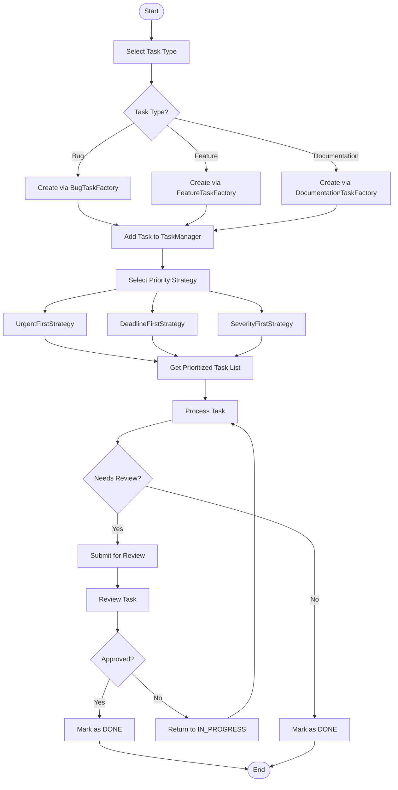

# Activity Diagram

This diagram models the **task lifecycle** from creation through prioritization to completion. It shows the decision points for task type selection, the parallel choice of priority strategy, and the review/rework loop.

