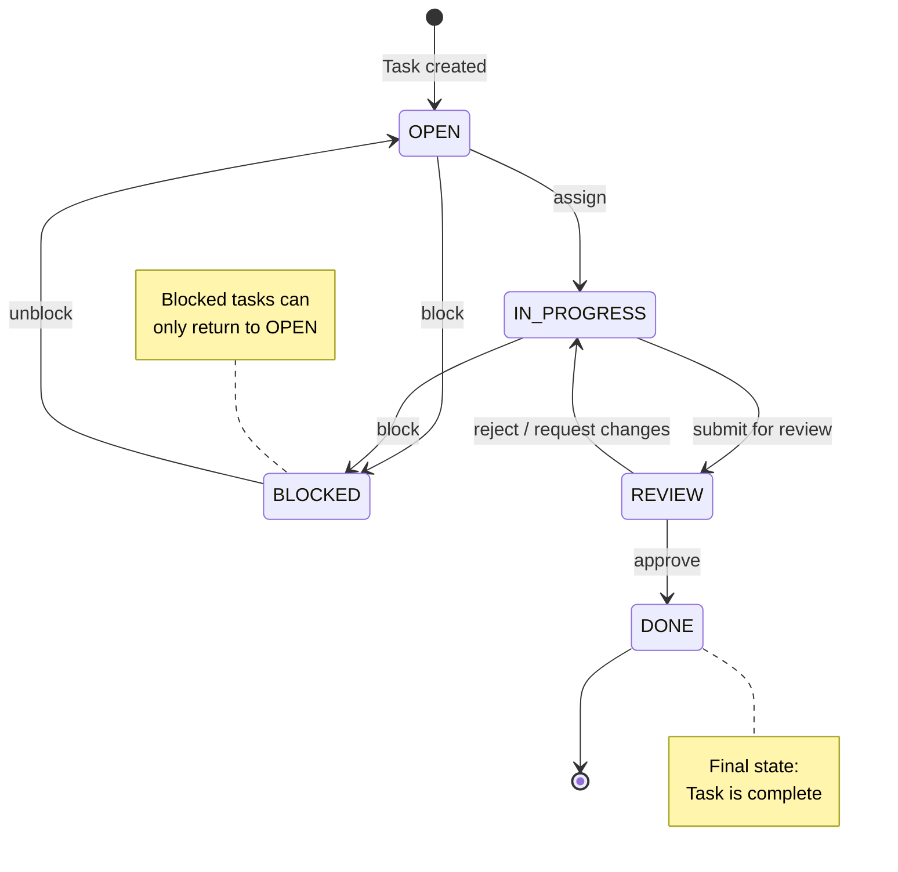

# State Diagram

This diagram shows the valid **status transitions** for a Task in the system. Tasks start in OPEN, move through IN_PROGRESS and REVIEW, and end in DONE. Tasks can be BLOCKED from OPEN or IN_PROGRESS and can only return to OPEN when unblocked.

