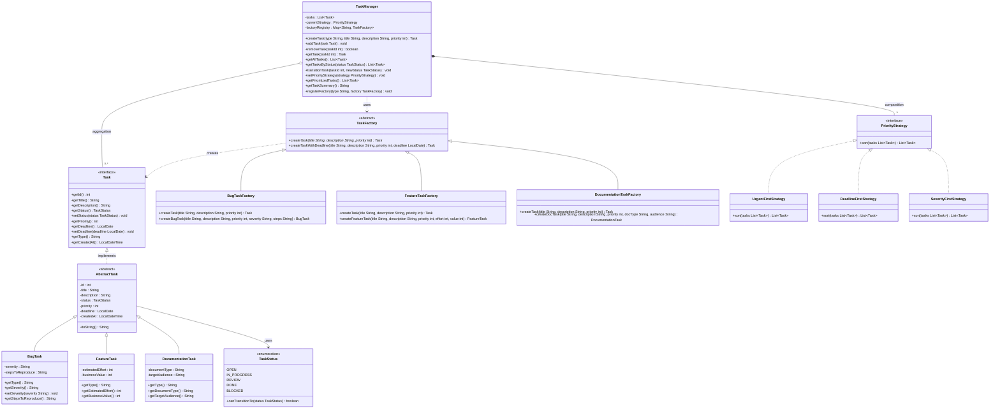

# Class Diagram

This diagram shows the full class hierarchy of the Task Management System, including the **Domain Model** (Task interface, AbstractTask, and concrete task types), the **Factory Module** (Factory Method pattern for task creation), the **Strategy Module** (Strategy pattern for prioritization), and the **TaskManager** that orchestrates everything.

