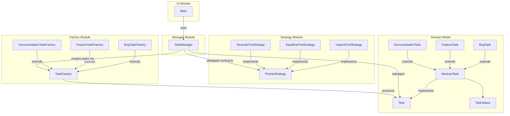

# Component Diagram

This diagram shows the high-level **module structure** of the Task Management System and the dependencies between components. The UI Module depends on the Manager, which in turn delegates to the Factory and Strategy modules and manages Domain Model entities.

