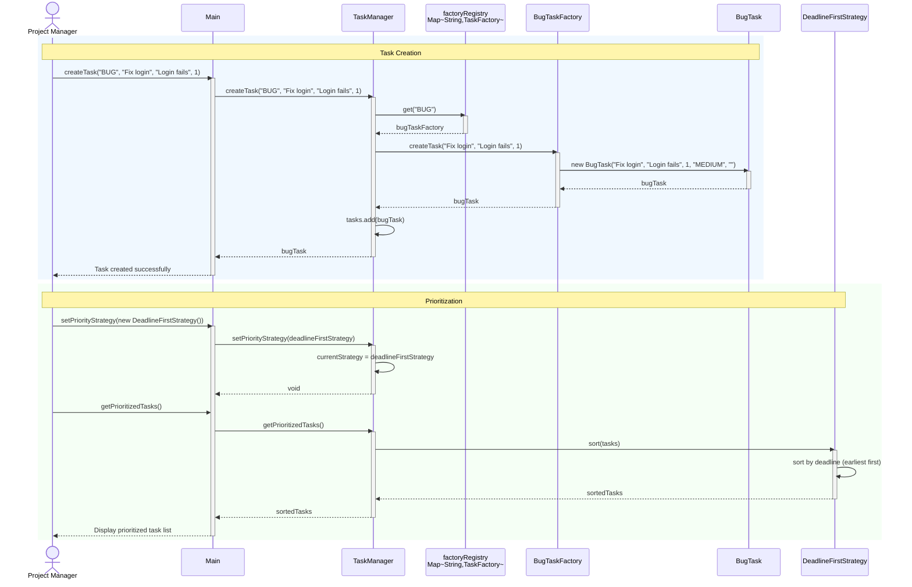

# Sequence Diagram

This diagram illustrates the runtime interactions for **creating a Bug task** and **prioritizing tasks** using the Deadline-First strategy. It shows how the Project Manager's request flows through Main, TaskManager, the factory registry, BugTaskFactory, and the strategy object.

