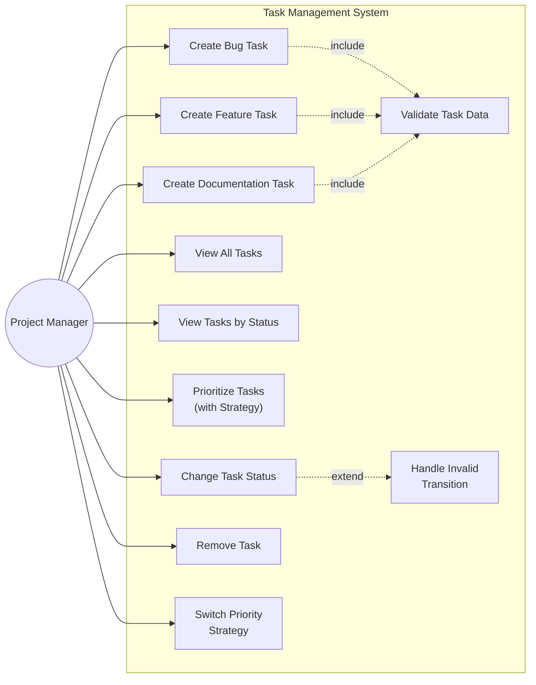

# Use Case Diagram

This diagram shows the use cases available to the **Project Manager** actor in the Task Management System. Task creation use cases include validation, and changing task status may trigger invalid-transition handling.

